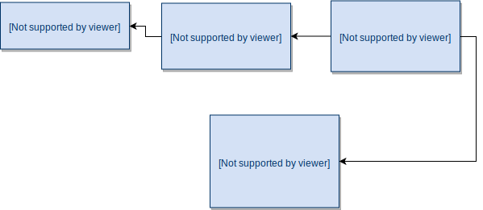

**NOTE: This example repository is not actively maintained. For later examples navigate to [Aito Docs](https://aito.ai/docs/).**

# Aito Grocery Store Demo App

**There are two hosted versions of the app**

Link | Branch | Description
-------- | ---- | -----------
[Simple](https://aito-grocery-store-demo-app.netlify.com/) | master |  Starting point. Simple functionality without Aito-integration
[Aito-integrated](https://aito-grocery-store-demo-app-smart.netlify.com/) | smart | Integrates to Aito and provides personalised features. The app has been modified to use the 2nd iterations of each excercise.

**Install**:

* Install https://nodejs.org/en/
* Then go to the project directory and run the following commands
* `npm install`
* `npm start`


## Background
This demo app has been created by Aito.ai for the purpose of showing features and functionalities of the [Aito.ai managed predictive database](https://aito.ai).
The application was originally created for [Hacktalks Helsinki, on November the 22nd of November 2018](https://www.hacktalks.fi/). The app is for demonstration purposes only, so many
special cases and error handling have been omitted in favour of readability and simplicity.

The demo software is licensed under the Apache 2 license, so it can be cloned and modified at will. It can therefore be used as a template Aito client application.
We accept pull requests in case you find something obvious missing or broken.

## The exercise
The application acts as a template for the Hacktalks workshop. The purpose is to have a _very simple_, yet somewhat useful application, which we make progressively smarter
by moving over the functionality to Aito. The aim is to show how easy it is to improve the application by using Aito.

### The data

For the scope of this exercise, there is only a limited data set with 42 products available.
The analytics data has been generated automatically, by simulating a few months of "life".
See [Data generator](#data-generator) for more. If you want to regenerate the data, see
[Running generator](#running-generator).

The low number of products is intentional to restrict the scope and
make the examples easy to understand. Applying machine learning to such a
limited set of products comes with certain restrictions, and the results
reflect these facts.

You can see the full product list via this link in [src/data/products.json](src/data/products.json).

The aim of this demo is not to show you how Aito is able to handle large datasets, but rather how a very basic grocery store app could be built and made intelligent by using Aito.

<br>



The aito schema is at [src/data/schema.json](src/data/schema.json).

<br>

| Table  | Description | Number of entries |
| ------------- | ------------- |:------:|
| users  | All known users. Key users: `larry`, `veronica`, `alice` | 3 |
| products  | All the products in the store | 42 |
| sessions  | Each session/visit per user | 168 |
| impressions  | All products a user has seen in a session, and if they bought it or not.  | 3360 |


### Setting

The exercises are focusing on these features:

- Recommendations based on the users’ previous shopping behaviour
- Dynamic recommendations – Aito won’t show you any recommendations if the products are already in your shopping basket
- Smart search: Aito recognises the users’ dietary restrictions and preferences, and shows search results accordingly
   - E.g. when lactose-free Larry search for milk, only lactose-free options are shown

**Links:**

* [API Documentation](https://aito.ai/docs/api)


## Exercise 1: Smart search

* Open [src/01-search.js](src/01-search.js)
* Edit the code so that it executes an Aito query, below you can find a few examples

### 1st iteration

Query which does a simple text matching without personalisation.

```js
import axios from 'axios'

export function getProductSearchResults(userId, inputValue) {
  return axios.post('https://aito-grocery-store.api.aito.ai/api/v1/_search', {
    from: 'products',
    where: {
      $or: [
        { name: { $match: inputValue } },
        { tags: { $match: inputValue } }
      ]
    },
    limit: 5
  }, {
    headers: { 'x-api-key': 'bc4Ck3nDwM1ILVjNahNJL8hPEAzCes8t2vGMUyo9' },
  })
    .then(response => {
      return response.data.hits
    })
}
```

### 2nd iteration

Query which personalises the results based on the user's previous shopping behavior.

```js
import axios from 'axios'

export function getProductSearchResults(userId, inputValue) {
  return axios.post('https://aito-grocery-store.api.aito.ai/api/v1/_recommend', {
    from: 'impressions',
    where: {
      'product.name': { "$match": inputValue },
      'session.user': userId
    },
    recommend: 'product',
    goal: { 'purchase': true },
    limit: 5
  }, {
    headers: { 'x-api-key': 'bc4Ck3nDwM1ILVjNahNJL8hPEAzCes8t2vGMUyo9' },
  })
    .then(response => {
      return response.data.hits
    })
}
```


## Exercise 2: Recommend products

* Open [src/02-recommend.js](src/02-recommend.js)
* Edit the code so that it executes an Aito query, below you can find a few examples

### 1st iteration

This query returns products which are not in the current shopping basket, but the
results are not personalised for a single user. The returned products would be
the most popular products across users.

```js
import axios from 'axios'

export function getRecommendedProducts(userId, currentShoppingBasket, count) {
  return axios.post('https://aito-grocery-store.api.aito.ai/api/v1/_recommend', {
    from: 'impressions',
    where: {
      'product.id': {
        $and: currentShoppingBasket.map(item => ({ $not: item.id })),
      }
    },
    recommend: 'product',
    goal: { 'purchase': true },
    limit: count
  }, {
    headers: { 'x-api-key': 'bc4Ck3nDwM1ILVjNahNJL8hPEAzCes8t2vGMUyo9' },
  })
    .then(result => {
      return result.data.hits
    })
}
```

### 2nd iteration

We simply add `'session.user': String(userId)` filter in the query, to get
personalised results.

```js
import axios from 'axios'

export function getRecommendedProducts(userId, currentShoppingBasket, count) {
  return axios.post('https://aito-grocery-store.api.aito.ai/api/v1/_recommend', {
    from: 'impressions',
    where: {
      'session.user': String(userId),
      'product.id': {
        $and: currentShoppingBasket.map(item => ({ $not: item.id })),
      }
    },
    recommend: 'product',
    goal: { 'purchase': true },
    limit: count
  }, {
    headers: {
      'x-api-key': 'bc4Ck3nDwM1ILVjNahNJL8hPEAzCes8t2vGMUyo9'
    },
  })
    .then(result => {
      return result.data.hits
    })
}
```


## Exercise 3: Get tag suggestions

* Open [src/03-get-tag-suggestions.js](src/03-get-tag-suggestions.js)
* Edit the code so that it executes an Aito query, below you can find a few examples

### 1st iteration

Query which predicts the most likely tags for a given product name.

```js
import axios from 'axios'

export function getTagSuggestions(productName) {
  return axios.post('https://aito-grocery-store.api.aito.ai/api/v1/_predict', {
    from: 'products',
    where: {
      name: productName
    },
    predict: 'tags',
    exclusiveness: false,
    limit: 3
  }, {
    headers: { 'x-api-key': 'bc4Ck3nDwM1ILVjNahNJL8hPEAzCes8t2vGMUyo9' },
  })
    .then(response => {
      return response.data.hits.map(hit => hit.feature)
    })
}
```

### 2nd iteration

This iteration can be useful in some cases. We add a filter for the probability,
to get only the tags we're most confident about.

```js
import axios from 'axios'

export function getTagSuggestions(productName) {
  return axios.post('https://aito-grocery-store.api.aito.ai/api/v1/_predict', {
    from: 'products',
    where: {
      name: productName
    },
    predict: 'tags',
    exclusiveness: false,
    limit: 10
  }, {
    headers: {
      'x-api-key': 'bc4Ck3nDwM1ILVjNahNJL8hPEAzCes8t2vGMUyo9'
    },
  })
    .then(response => {
      return response.data.hits
        .filter(e => e.$p > 0.5)  // Filter out results which are not very strong
        .map(hit => hit.feature)
    })
}
```


## Data generator

Source data files are [src/data/products.json](src/data/products.json) and [src/data/preferences.json](src/data/preferences.json).

* `products.json` Contains all products in the shop
* `preferences.json` Describes a tag-based configuration of what products users like

If you want to regenerate the data, see [Running generator](#running-generator).

### Step 1: weekly schedule

Based on [preferences.json](src/data/preferences.json), we generate a weekly schedule for each user.
The schedule describes what products the user will purchase each day.

When generating the weekly schedule, we first create a pool of potential products the user might
purchase on any day. This will be generated based on the `tag` and `howMuchThePersonLikesTheseProducts`
in the preferences.json. If a tag is not listed in preferences.json, the products with that tag
won't be added to the pool *(unless the product has another tag which is listed in preferences.json)*.

Number 1 in `howMuchThePersonLikesTheseProducts` means that we'll add each product with that tag
once to the pool of the potential products the user could purchase. Number 5 would mean we add
each product 5 times in the potential product pool. As an example, if we had this config:

```json
[
  { "tag": "milk", "howMuchPersonLikesTheseProducts": 1 },
  { "tag": "candy", "howMuchPersonLikesTheseProducts": 2 }
]
```

and there would be only 2 products in the whole shop:
```json
[
  { "id": 1, "name": "Milk 1 liter", "tags": "milk" },
  { "id": 2, "name": "Candy 200g", "tags": "candy" }
]
```

The potential product pool would look like this:
```json
[
  { "id": 1, "name": "Milk 1 liter", "tags": "milk" },
  { "id": 2, "name": "Candy 200g", "tags": "candy" },
  { "id": 2, "name": "Candy 200g", "tags": "candy" }
]
```

For each day, we specified amount of products randomly from the potential product pool. It's
random, and with good/bad luck the user could buy only 10x Candy 200g.

Tags might have overlapping products, but the generator doesn't compansate this in any way.

This output will be saved under [src/data/generated](src/data/generated) directory. It's automatically
generated file, but it won't be uploaded to Aito.


### Step 2: sessions and impressions

Based on [weeklySchedule.json](src/data/generated/weeklySchedule.json), we simulate 8 weeks of "life",
where users visit (1 visit = **1 session**) the grocery store each day. On each visit, the
user sees for example 20 products, and purchases 10 of them. Whenever user sees a product, it's called
an **impression**. The impression may have two outcomes: either they purchase the product or not.

On each visit, the user sees more products than they actually purchase. The products which user
does *not* purchase, are randomly selected from the products which are missing from their potential
product pool.

The output files *users.json*, *impressions.json* and *sessions.json* will be saved under
[src/data/aito](src/data/aito) directory. [src/data/products.json](src/data/products.json) is
also copied under the same directory. Each file in the directory corresponds one table in Aito.


### Running generator

To generate the data, you can use a commandline tool. The tool will pretty print the generated
data in a format which might be a bit more readable then the raw output json files.
The normal workflow goes like this:

1. Run `node src/generator/index.js --info` to understand what tags and products are available
1. Update products.json or preferences.json
1. Regenerate everything
1. Make sure the generated weeklySchedules.json looks as expected. It is generated based on preferences.json.


**Regenerate everything**
```bash
node src/generator/index.js
```

**List all tags and products**

This is useful when creating new user "taste" profiles.

```bash
node src/generator/index.js --info
```

**Regenerate only the weeklySchedule.json**

This is more useful for debugging the process.

```bash
node src/generator/index.js --only-weekly-schedules
```

**See help**

```bash
node src/generator/index.js -h
```
