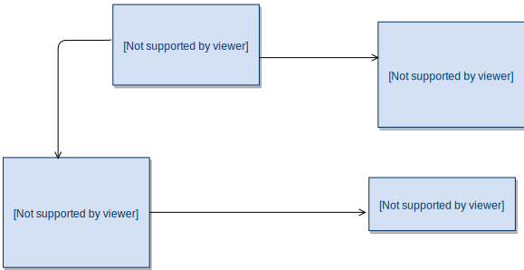

# Aito Grocery Store Demo App

## Background
This demo app has been created by Aito.ai for the purpose of showing features and functionalities of the [Aito.ai managed machine learning database](https://aito.ai).
The application was originally created for [Hacktalks Helsinki, on November the 22nd of November 2018](https://www.hacktalks.fi/). The app is for demonstration purposes only, so many
special cases and error handling have been omitted in favour of readability and simplicity.

The software is licensed under the Apache 2 license, so it can be cloned and modified at will. It can therefore be used as a template Aito client application.
We accept pull requests in case you find something obvious missing or broken.

## The exercise
The application acts as a template for the Hacktalks workshop. The purpose is to have a _very simple_, yet somewhat useful application, which we make progressively smarter
by moving over the functionality to Aito. The aim is to show how easy it is to improve the application by using Aito.

### The data
For the scope of this exercise, there is only a limited data set with 42 products available. The low number of products is intentional to restrict the scope and
make the examples easy to understand. Applying machine learning to such a limited set of products comes with certain restrictions, and the results reflect these facts.

You can see the full product list via this link: https://github.com/AitoDotAI/grocery-store-demo-app/blob/master/src/data/products.json

The aim of this demo is not to show you how Aito is able to handle large datasets, but rather how a very basic grocery store app could be built and made intelligent by using Aito.



| Table  | Description | Number of entries |
| ------------- | ------------- |:------:|
| users  | All known users. Key users: `larry`, `veronica`, `alice` | 67 |
| products  | All the products sold in the store | 42 |
| userBehavior  | "Analytics" data with user actions in a given setting  | 3805 |
| decisions  | Individual decisions for products   | 63341 |

### Setting
The exercises are focussing on these features:

- Recommendations based on the users’ previous shopping behaviour
- Dynamic recommendations – Aito won’t show you any recommendations if the products are already in your shopping basket
- Smart search: Aito recognises the users’ dietary restrictions and preferences, and shows search results accordingly
   - E.g. when lactose-free Larry search for milk, only lactose-free options are shown

**Links:**

* [API Documentation](https://aito-grocery-store.api.aito.ai/docs/v1/api/index.html)


## Exercise 1: Smart search

* Open 01-search.js
* Edit the code to execute an Aito query, below you can find an example query


```js
import axios from 'axios'

export function getProductSearchResults(userId, inputValue) {
  return axios.post('https://aito-grocery-store.api.aito.ai/api/v1/_search', {
    from: 'products',
    where: {
      $or: [
        { name: { $match: inputValue } },
        { tags: { $match: inputValue } }
      ]
    },
    limit: 5
  }, {
    headers: { 'x-api-key': 'FWuBYAfGzXa2a0FUreVPL6EqS01kbVnw9ABjJjSZ' },
  })
    .then(response => {
      return response.data.hits
    })
}
```


## Exercise 2: Recommend products

* Open 02-recommend.js
* Edit the code to execute an Aito query, below you can find an example query


```js
import axios from 'axios'

export function getRecommendedProducts(userId, currentShoppingBasket, count) {
  return axios.post('https://aito-grocery-store.api.aito.ai/api/v1/_recommend', {
    from: 'decisions',
    where: {
      'product.id': {
        $and: currentShoppingBasket.map(item => ({ $not: item.id })),
      }
    },
    recommend: 'product',
    goal: { 'purchase': true },
    limit: count
  }, {
    headers: { 'x-api-key': 'FWuBYAfGzXa2a0FUreVPL6EqS01kbVnw9ABjJjSZ' },
  })
    .then(result => {
      return result.data.hits
    })
}
```


## Exercise 3: Get tag suggestions

* Open 03-get-tag-suggestions.js
* Edit the code to execute an Aito query, below you can find an example query


```js
import axios from 'axios'

export function getTagSuggestions(productName) {
  return axios.post('https://aito-grocery-store.api.aito.ai/api/v1/_predict', {
    from: 'products',
    where: {
      name: productName
    },
    predict: 'tags',
    exclusiveness: false,
    limit: 3
  }, {
    headers: { 'x-api-key': 'FWuBYAfGzXa2a0FUreVPL6EqS01kbVnw9ABjJjSZ' },
  })
    .then(response => {
      return response.data.hits.map(hit => hit.feature)
    })
}
```
